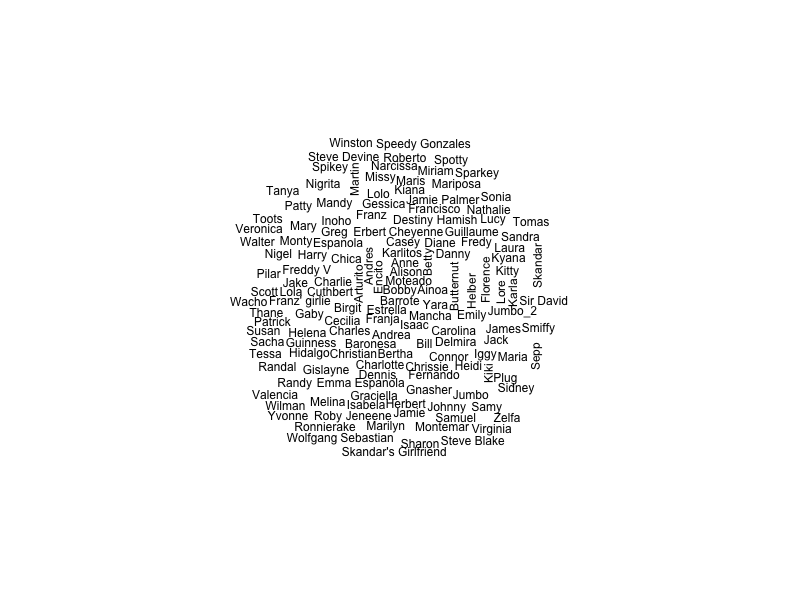

# 🧠 Human Psychology of Conservation: Naming Patterns in Animal Tracking
# By Diego Ellis Soto, diego.ellissoto@berkeley.edu, University of California Berkeley

## ✨ Overview

This project explores the **intersection of human culture, naming practices, and biodiversity conservation**, particularly in the context of animal tracking data from Movebank. It investigates how naming conventions of tracked animals may reflect **human psychological and cultural patterns**, and how these patterns vary across **taxonomic groups**, **countries**, and **latitudinal gradients**.

## 🌍 Motivation

Conservation science increasingly integrates not only ecological data but also human behavior and perception. Names given to animals — whether human, mythological, or descriptive — can reveal:
- Human affinity or bias toward certain species.
- Cultural lenses and anthropomorphic tendencies in wildlife study.
- Global disparities in biodiversity attention.

Understanding these dimensions may help **uncover hidden biases in research effort** and **design more inclusive conservation messaging**.

---

## 🧪 Workflow Summary

This analysis combines **Movebank tracking metadata**, **global naming datasets**, and **taxonomic services** to assess the psychology of naming across space and species.

### 🔧 Setup

- **R packages**: `move`, `sf`, `dplyr`, `ggplot2`, `babynames`, `stringdist`, `rgbif`, `rnaturalearth`, etc.
- **Directory structure**: All outputs saved in an `outdir/` directory.

### 1. ✅ Load & Authenticate

Authenticate into Movebank to access metadata from selected studies.

login <- movebankLogin(username = "XXX", password = "XXX")

# Future work/next steps::
Probability of names by country: https://github.com/Kyubyong/name2nat
Names by country dataset https://github.com/sigpwned/popular-names-by-country-dataset
Undergraduate work:
Site of baby names python:
Accept terms and agreements
Taxonomy
Look at author name responsible and country of origin
Taxonomic Done
Accept Manually all those studies
Add matrix of names and their countries from python global
Do some plots of language to language based on country ->
Global map of individuals per grid cell of this movebank study
Add Elton Traits
global plot of country to country
gloal plot of GDP from country to country
whats the most common name of a individual animal tracked?
Plot creativity vs. name popularity
